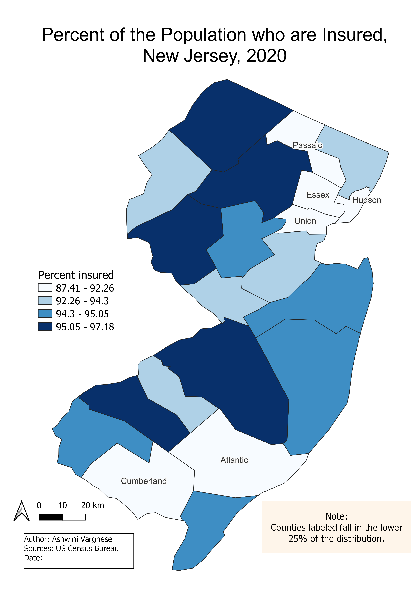
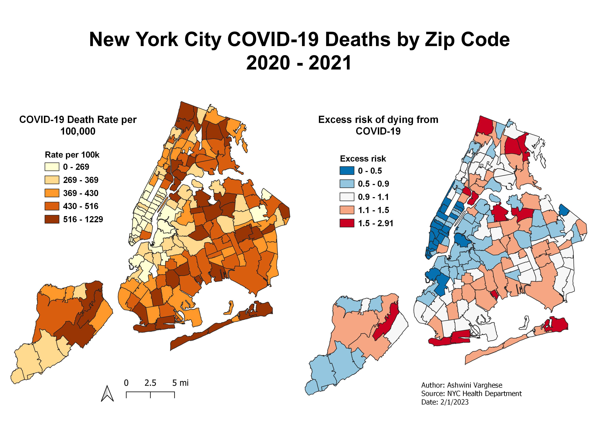
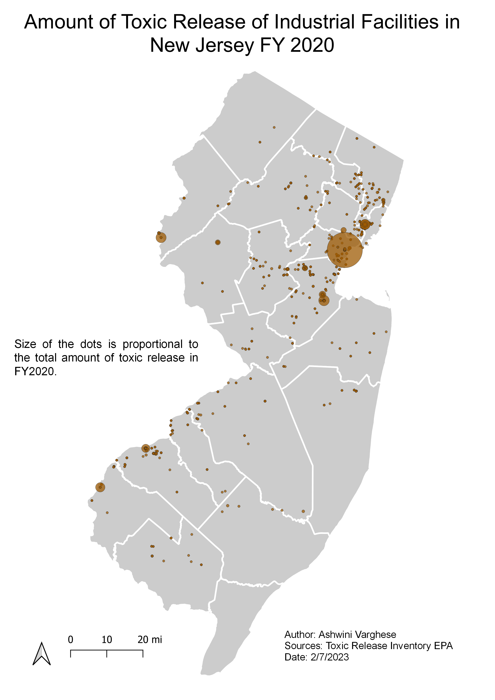
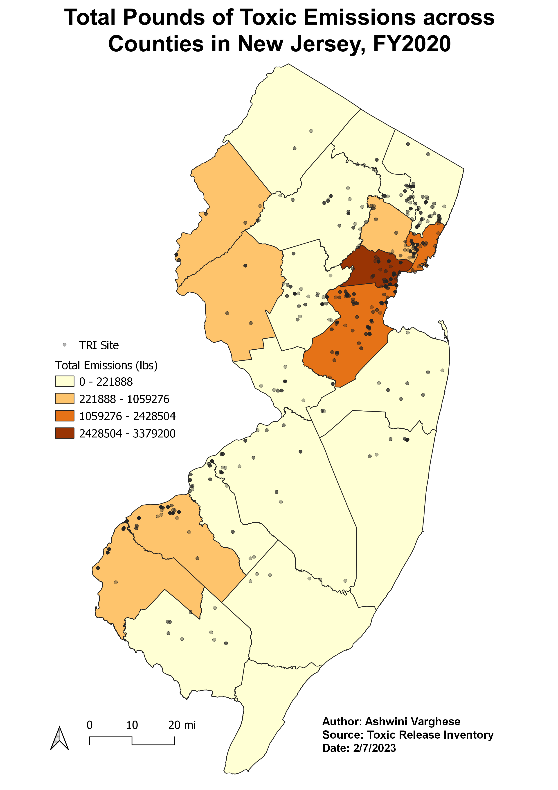
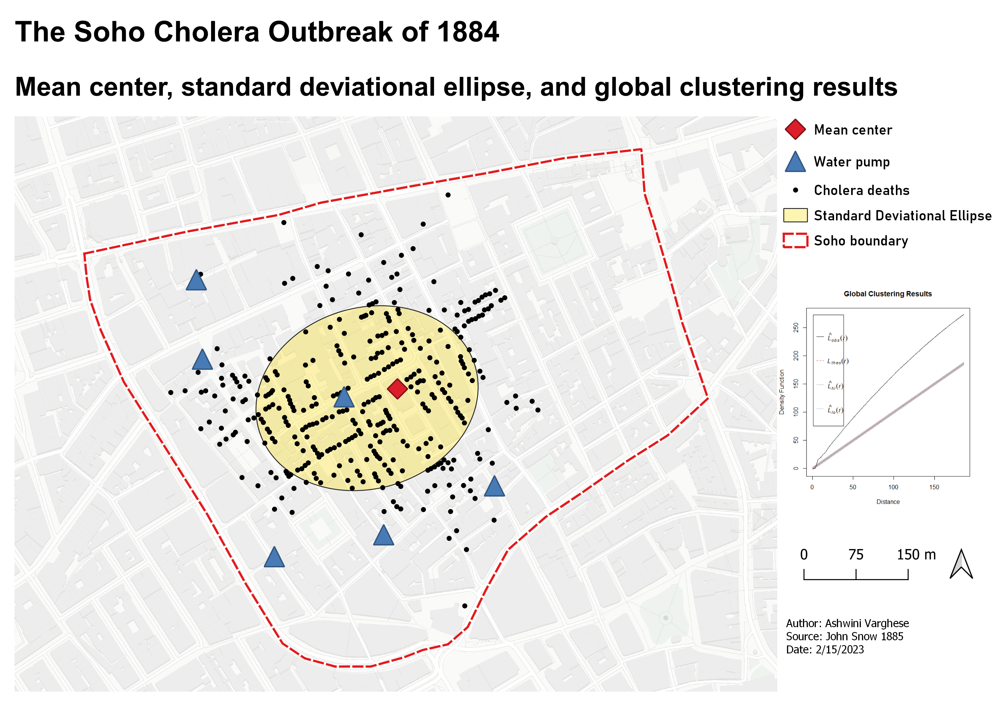

_____________________________________________________________________________
## Insured people in New Jersey 

  

_____________________________________________________________________________
## NYC Covid Deaths

_____________________________________________________________________________
## Toxic Release in New Jersey 

_____________________________________________________________________________
## Pounds of Toxic Emissions in New Jersey 

_____________________________________________________________________________
## Soho Cholera outbreak, 1884 

_____________________________________________________________________________
## Kernel Density May of Cholera outbreak, 1884

