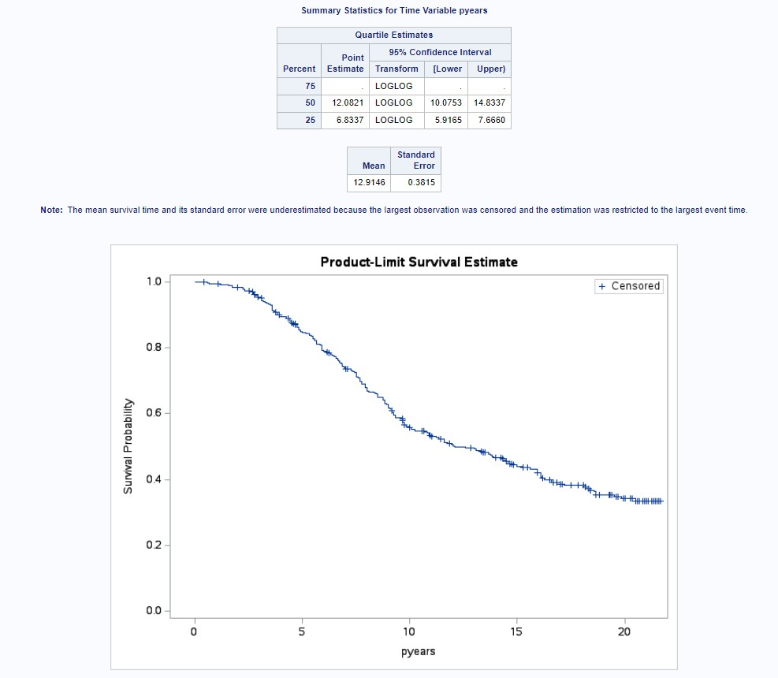

## NHANES Analysis 2015-2016:

The full abstract for this project can be found [here](NHANES.pdf).

**Research question of interest: Is age at first sex associated with ever being diagnosed with an STI?**

* Data source: NHANES 2015-2016
* Population: U.S. adults aged 18-59
* Predictors: Sexual identity, monthly family income, and gender
* EMM: current age

### Code:

**IMPORTING NHANES 2015-16 DATA**; 

filename A "/home/u60713693/sasuser.v94/SXQ_I.XPT";  
filename B "/home/u60713693/sasuser.v94/DEMO_I.XPT";  
filename C "/home/u60713693/sasuser.v94/INQ_I.XPT";  
 
proc http url = "https://wwwn.cdc.gov/Nchs/Nhanes/2015-2016/SXQ_I.XPT"  
out = A;  
run;  

proc http url = "https://wwwn.cdc.gov/Nchs/Nhanes/2015-2016/DEMO_I.XPT"  
out = B;  
run;  

proc http url = "https://wwwn.cdc.gov/Nchs/Nhanes/2015-2016/INQ_I.XPT"  
out = C;  
run;  

libname A xport "/home/u60713693/sasuser.v94/SXQ_I.XPT";  
libname B xport "/home/u60713693/sasuser.v94/DEMO_I.XPT";  
libname C xport "/home/u60713693/sasuser.v94/INQ_I.XPT";  

**CREATING SAS DATASETS FROM THE XPT FILES**;  

data sxq_i; set A.SXQ_I;  
data demo_i; set B.DEMO_I;  
data inq_i; set C.INQ_I;  

**MERGING THE DATASETS AND KEEPING VARIABLES OF INTEREST**;  

proc sort data = inq_i;  
by SEQN;  
run;  

proc sort data = demo_i;  
by SEQN;  
run;  

proc sort data = sxq_i;  
by SEQN;  
run;  

data project;  
merge sxq_i (in = a)  
	    demo_i (in = b)  
	    inq_i (in = c);  
by SEQN;  
if a and b and c;  
keep SEQN RIDAGEYR RIAGENDR SXD031 SXQ260 SXQ265  
	   SXQ270 SXQ272 SXQ295 SXQ296 IND235;  
run;  

*/obs = 4843    

**EXPOSURE/OUTCOME**;  

**DELETING MISSING/REFUSED/DON'T KNOW VALUES**;  

data project; set project;  
	if SXD031 in (77,99,.) then delete;  
run;  

*/ obs = 3983  

**COMBINING STI STATUSES INTO ONE BINARY VAR**;  

data project; set project;  
if SXQ260 in (7,9,.) or SXQ265 in (7,9,.) or  
   SXQ270 in (7,9,.) or SXQ272 in (7,9,.) then delete;  
	if SXQ260 = 1 then STI_status = 1;  
 	else if SXQ265 = 1 then STI_status = 1;  
 	else if SXQ270 = 1 then STI_status = 1;  
 	else if SXQ272 = 1 then STI_status = 1;  
 	else STI_status = 0;  
run;  

**CONFOUNDERS/EMM**;  

**OPERATIONALIZING INCOME**;  

data project; set project;  
if IND235 in (77,99,.) then delete;  
if IND235 in (1,2,3) then monthly_inccat = 1;  
	else if IND235 in (4,5,6) then monthly_inccat = 2;  
	else if IND235 in (7,8,9) then monthly_inccat = 3;  
	else if IND235 in (10,11,12) then monthly_inccat = 4;  
run;  

**OPERATIONALIZING SEXUAL IDENTITY**;  

data project; set project;  
if SXQ295 in (6,7,9,.) and SXQ296 in (6,7,9,.) then delete;  
if SXQ295 = 2 or SXQ296 = 2 then sexual_id = 0;  
	else sexual_id = 1;  
run;  

**OPERATIONALIZING CURRENT AGE**;  

data project; set project;  
if 18 le RIDAGEYR < 30  then age_cat = 1;  
	else if 30 le RIDAGEYR < 40  then age_cat = 2;  
	else if 40 le RIDAGEYR < 50  then age_cat = 3;  
	else if 50 le RIDAGEYR < 60  then age_cat = 4;  
run;  

proc freq data = project;  
table RIDAGEYR RIAGENDR SXD031 SXQ260 SXQ265  
	    SXQ270 SXQ272 SXQ295 SXQ296 IND235;  
run;  

proc sort data = project;  
by STI_status;  
run;  

proc freq data = project;  
table RIAGENDR;  
by STI_status;  
run;  

**CHECKS**  

proc freq data=project;  
tables RIDAGEYR;  

proc freq data=project;  
tables age_cat;  

proc contents data=project;  
*/

**LOGISTIC REGRESSIONS**;  

title 'Crude Model';  
proc logistic data = project;  
	class STI_status (ref = '0') / param = ref;  
	model STI_status = SXD031 / cl scale = none;  
run;  

title 'Adjusted Model';  
proc logistic data = project;  
	class STI_status (ref = '0') / param = ref;  
	class age_cat (ref = '1') / param = ref;  
	class RIAGENDR (ref = '1') / param = ref;  
	class monthly_inccat (ref = '1') / param = ref;  
	class sexual_id (ref = '0') / param = ref;  	
	model STI_status = SXD031 age_cat RIAGENDR monthly_inccat sexual_id SXD031*age_cat / cl scale = none;  
run;  

## Survival Analysis Example:

**Dataset of Interest:** This data is a subset of data from a cohort study on human immunodeficiency virus (HIV) infection. The study includes medical, epidemiologic, and behavioral information from individuals who are HIV positive. Below is the data dictionary:

**Research question: We will examine if having a diagnosis of hepatitis C is associated with a shorter median survival time compared to not having hepatitis C.**

### Code:

**Creating a libname to refer to shared folder:**

libname Epi3 "/home/u60713693/my_shared_file_links/u2704008";

**Copy and explore the data:**

data hivhepc;   
set Epi3.hivhepc;   
run;

proc contents data= hivhepc;    
run;

**Calculate person-time for each individual:**

data hivhepc2;    
set hivhepc;    
if death=1 then days=death_date-cohort_date;    
else if death=0 then days=last_alive_date-cohort_date;    
pyears=days/365.25;  *gives time-to-event in years;   
run;

### General survival curve:

proc lifetest data= hivhepc2 method=km plots=(s) graphics;    
time pyears*death(0);   
run;

The full results of the proc lifetest can be seen [here](survival.html).

Below is the survival curve:

The median survival time is 12.08 years, which is interpreted as: We expect 50% of people to survive beyond 12.08 years.

Another interpretation example: Using the table and the 'pyears' value closest to 5 (which is 4.9993), the 5-year survival probability is 0.8470, which means that probability of surviving beyond 5 years from the time of HIV diagnosis is 0.8470.

### Survival curve by Hep. C diagnosis:

proc lifetest data= hivhepc2 method=km plots=(s)graphics;   
time pyears*death(0);   
strata HepC;    
run;

The full results of the proc lifetest can be seen [here](hepc.html).

Below is the survival curve:

The median survival proportion for those with a Hep. C diagnosis is 11.33 years and for those without a Hep. C diagnosis is 14.33 years. This means that individuals who are HIV+ survive longer if they don't have a Hep. C diagnosis.

### Significance of survival curves:

The log-rank test has a null hypothesis that the two survival curves are homogeneous (not different from one another). Given the p-value of the statistic (p=0.0307), we can reject the null hypothesis and conclude that the survival curves ARE NOT HOMOGENOUS and are STATISTICALLY significantly different.

### Univariable Cox Regression:

**We will run a Cox regression model to investigate the association between survival and having a Hepatitis C diagnosis among HIV+ males.**

proc phreg data=lab7;   
model pyears*death(0)= hepc / ties=efron rl;    
run;

The full results of the regression can be seen [here](univariable.html).

**The hazard ratio is 1.385 with a 95% CI (1.029, 1.863).**

**The interpretation is: Among HIV+ males, those with Hep. C have a 38.5% higher hazard of death compared to those without Hep. C. We are 95% confident the true hazard is between 2.9% and 86.3%.**

### Assessing the Proportional Hazard Assumption:

**The assumption: At any point in time, the ratio of the hazards for any two individuals or groups is constant.**

There are 3 ways to check the assumption:

**1. Graph the curves and visually inspect to see if the curves are proportional**    
**2. Model an interaction term between the log of time and the covariate**    
**3. Use cumulative sums of martingale-based residuals** 

#### Method 1:

proc phreg data=lab7;   
model pyears*death(0) = IVdruguse/ties =efron;    
strata IVdruguse;   
baseline out=c loglogs=lls survival=s;    
run;    

proc gplot data=c ;   
plot lls*pyears  =IVdruguse;    
symbol1 interpol=join color=magenta line=1;   
symbol2 interpol=join color=navy line=1;    
title 'Proportional Hazards Assumption for Variable IVdruguse';   
run;    
quit;   

Visually, the lines do not seem to be proportional; at some points they are close and at others, they diverge.

#### Method 2:

data survival;    
set lab7;   
LNpy=log(pyears);   
run;    

proc phreg data=survival;   
model pyears*death(0) = IVdruguse LNpy*IVdruguse/ties=efron;    
run;    

The interaction term has a p-value <.0001 which is less than 0.05, thus significant. This means that the hazard function changes over time and that the assumption is violated.

#### Method 3:

proc phreg data=lab7;   
model pyears*death(0) = IVdruguse/ties =efron;    
assess ph / resample seed=40262001;   
run;    

The observed path has deviated appreciably from the cloud of paths generated via simulations that followed the proportional hazard assumption. In addition, the p-value for the test of proportional hazards was 0.0180 which is less than 0.05. We can conclude again that the assumption is not met.

#### Solutions to the violation of the assumption:

1. Stratify by the levels of the variable for which the assumption fails
2. Stratify by time (fit separate Cox models to different time intervals)
3. Extensions of Cox models to allow for covariates that vary with time

