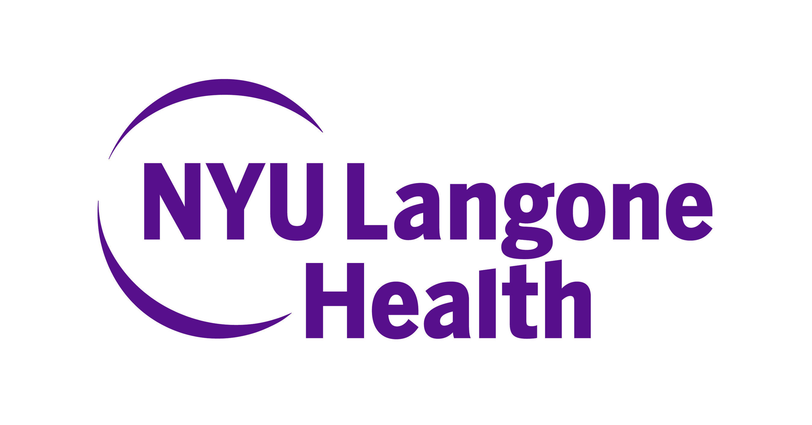

&nbsp;

&nbsp;A Highly organized and self-motivated Data Analyst with 3 years of experience and a strong quantitative aptitude. Skilled at interpreting complex data with exceptional attention to detail and hands-on analysis experience using R and SAS. Proven to excel in a fast-paced, collaborative environment while always eager to be challenged and learn new analytic techniques

&nbsp;

&nbsp;

# About me:

I am a Data Analyst at NYU Langone Health in New York City for the [Cardiovascular Digital Health Lab](https://med.nyu.edu/departments-institutes/medicine/divisions/cardiology/research/cardiovascular-digital-health-laboratory) in the Division of Cardiology. 

I completed a Master's in Public Health degree in Epidemiology, with a certificate in Infectious Disease Epidemiology, at the Columbia University Mailman School of Public Health in New York City in 2023.

I completed a Bachelor of Science in Public Health with a minor in Biological Sciences and a certificate in Health Disparities at Rutgers University - New Brunswick in 2020.

                                               
          

 

My favorite activities are to cook new recipes and exploring NYC restaurants and all the activities the city has to offer. One of my life goals is to travel to one new country every year and explore the world!

&nbsp;

                                               
          

  

_____________________________________________________________________________

# Upcoming project:

&nbsp;

### Behavioral Economics Trial To Enhance Regulation of Blood Pressure [(BETTER-BP)](https://www.sciencedirect.com/science/article/pii/S2772487522000320?via%3Dihub)

&nbsp;

Funded by the National Heart, Lung, And Blood Institute (NHLBI) of the National Institutes of Health (NIH), this is a randomized clinical trial (RCT) founded on behavioral economics and tests whether a lottery incentive program promotes adherence to anti hypertensive medication and blood pressure control at 6 and 12 months. 

&nbsp;

**Current status:**

Enrollment has been completed and analysis of the primary and secondary process and efficacy outcomes are projected to be completed by the end of 2025  

                                               
          

  

&nbsp;

