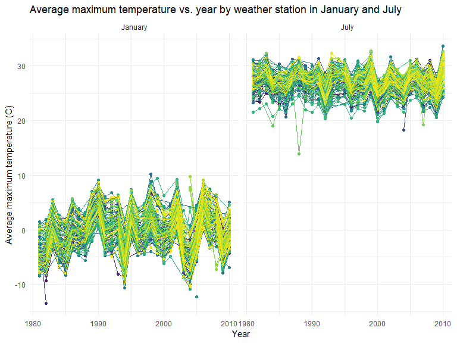
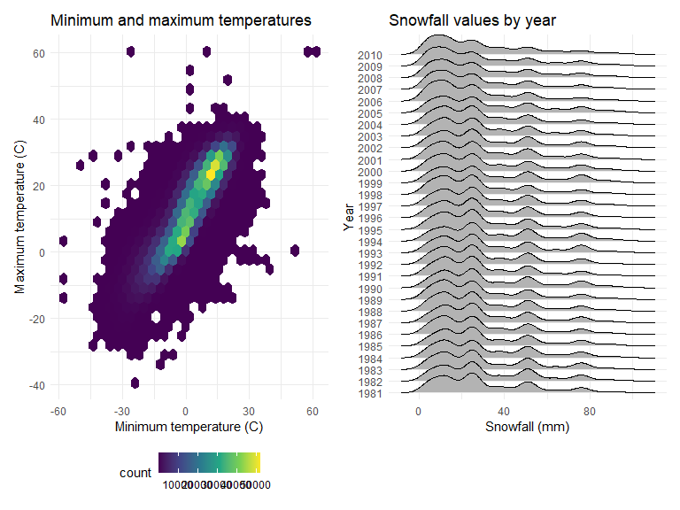

R Programming Code
================

## Preparation:

We’ll start by having a code chunk in the beginning that loads all the
packages we will need and set up formatting for visualizations:

## Data cleaning and Tidying:

### NYC Transit dataset cleaning:

This dataset contains information related to each entrance and exit for
each subway station in NYC.

We will start by reading in the datafile using the `readr` function from
the `tidyverse` package and cleaning the data by using the `clean_names`
function from the `janitor` package. We will also retain certain
variables and convert the entry variable from a character variable to a
logical variable.

``` r
subway = read_csv("./data/Subway.csv") %>% 
    janitor::clean_names() %>% 
    select(line, station_name, station_latitude, station_longitude, 
      starts_with("route"), entry, exit_only, vending, entrance_type, ada) %>% 
    mutate(entry = ifelse(entry == "YES", TRUE, FALSE)) %>% 
    mutate(route8 = as.character(route8)) %>%  
    mutate(route9 = as.character(route9)) %>% 
    mutate(route10 = as.character(route10)) %>% 
    mutate(route11 = as.character(route11)) 
```

    ## Rows: 1868 Columns: 32
    ## ── Column specification ──────────────────────────────────────────────────────────────────
    ## Delimiter: ","
    ## chr (22): Division, Line, Station Name, Route1, Route2, Route3, Route4, Rout...
    ## dbl  (8): Station Latitude, Station Longitude, Route8, Route9, Route10, Rout...
    ## lgl  (2): ADA, Free Crossover
    ## 
    ## ℹ Use `spec()` to retrieve the full column specification for this data.
    ## ℹ Specify the column types or set `show_col_types = FALSE` to quiet this message.

``` r
subway
```

    ## # A tibble: 1,868 × 20
    ##    line     station_…¹ stati…² stati…³ route1 route2 route3 route4 route5 route6
    ##    <chr>    <chr>        <dbl>   <dbl> <chr>  <chr>  <chr>  <chr>  <chr>  <chr> 
    ##  1 4 Avenue 25th St       40.7   -74.0 R      <NA>   <NA>   <NA>   <NA>   <NA>  
    ##  2 4 Avenue 25th St       40.7   -74.0 R      <NA>   <NA>   <NA>   <NA>   <NA>  
    ##  3 4 Avenue 36th St       40.7   -74.0 N      R      <NA>   <NA>   <NA>   <NA>  
    ##  4 4 Avenue 36th St       40.7   -74.0 N      R      <NA>   <NA>   <NA>   <NA>  
    ##  5 4 Avenue 36th St       40.7   -74.0 N      R      <NA>   <NA>   <NA>   <NA>  
    ##  6 4 Avenue 45th St       40.6   -74.0 R      <NA>   <NA>   <NA>   <NA>   <NA>  
    ##  7 4 Avenue 45th St       40.6   -74.0 R      <NA>   <NA>   <NA>   <NA>   <NA>  
    ##  8 4 Avenue 45th St       40.6   -74.0 R      <NA>   <NA>   <NA>   <NA>   <NA>  
    ##  9 4 Avenue 45th St       40.6   -74.0 R      <NA>   <NA>   <NA>   <NA>   <NA>  
    ## 10 4 Avenue 53rd St       40.6   -74.0 R      <NA>   <NA>   <NA>   <NA>   <NA>  
    ## # … with 1,858 more rows, 10 more variables: route7 <chr>, route8 <chr>,
    ## #   route9 <chr>, route10 <chr>, route11 <chr>, entry <lgl>, exit_only <chr>,
    ## #   vending <chr>, entrance_type <chr>, ada <lgl>, and abbreviated variable
    ## #   names ¹​station_name, ²​station_latitude, ³​station_longitude

This dataset contains 20 columns and 1868 rows It has the 20 variables
that we selected it to keep. We imported the file, used the
`clean_names` function to do a quick clean. Then we selected what
variables we wanted to keep. Some of the route variables were in `dbl`
format instead of `chr` like most of the route variables so we changed
that. And lastly we turned the entry variable from character into a
logical variable.

This data is not tidy because the route variables should be converted
from a wide to long format.

We can use the following code to find the number of distinct stations:

``` r
subway %>% 
  select(station_name, line) %>% 
  distinct
```

    ## # A tibble: 465 × 2
    ##    station_name             line    
    ##    <chr>                    <chr>   
    ##  1 25th St                  4 Avenue
    ##  2 36th St                  4 Avenue
    ##  3 45th St                  4 Avenue
    ##  4 53rd St                  4 Avenue
    ##  5 59th St                  4 Avenue
    ##  6 77th St                  4 Avenue
    ##  7 86th St                  4 Avenue
    ##  8 95th St                  4 Avenue
    ##  9 9th St                   4 Avenue
    ## 10 Atlantic Av-Barclays Ctr 4 Avenue
    ## # … with 455 more rows

There are 465 distinct stations.

We can use the following code to find the number of ADA compliant
stations:

``` r
subway %>% 
  filter(ada == TRUE) %>% 
  select(station_name, line) %>% 
  distinct
```

    ## # A tibble: 84 × 2
    ##    station_name                   line           
    ##    <chr>                          <chr>          
    ##  1 Atlantic Av-Barclays Ctr       4 Avenue       
    ##  2 DeKalb Av                      4 Avenue       
    ##  3 Pacific St                     4 Avenue       
    ##  4 Grand Central                  42nd St Shuttle
    ##  5 34th St                        6 Avenue       
    ##  6 47-50th Sts Rockefeller Center 6 Avenue       
    ##  7 Church Av                      6 Avenue       
    ##  8 21st St                        63rd Street    
    ##  9 Lexington Av                   63rd Street    
    ## 10 Roosevelt Island               63rd Street    
    ## # … with 74 more rows

There are 84 ADA compliant stations.

We can use the following code to find the proportion of station
entrances/exits without vending allow entrance:

``` r
subway %>% 
  filter(vending == "NO") %>% 
  pull(entry) %>% 
  mean
```

    ## [1] 0.3770492

The proportion is 0.377.

We can use the following code to find how many stations serve the A
train and of the stations that serve the A train, how many are ADA
compliant:

``` r
subway %>% 
  pivot_longer(
    route1:route11,
    names_to = "route_num",
    values_to = "route") %>% 
  filter(route == "A") %>% 
  select(station_name, line) %>% 
  distinct
```

    ## # A tibble: 60 × 2
    ##    station_name                  line           
    ##    <chr>                         <chr>          
    ##  1 Times Square                  42nd St Shuttle
    ##  2 125th St                      8 Avenue       
    ##  3 145th St                      8 Avenue       
    ##  4 14th St                       8 Avenue       
    ##  5 168th St - Washington Heights 8 Avenue       
    ##  6 175th St                      8 Avenue       
    ##  7 181st St                      8 Avenue       
    ##  8 190th St                      8 Avenue       
    ##  9 34th St                       8 Avenue       
    ## 10 42nd St                       8 Avenue       
    ## # … with 50 more rows

``` r
subway %>% 
  pivot_longer(
    route1:route11,
    names_to = "route_num",
    values_to = "route") %>% 
  filter(route == "A", ada == TRUE) %>% 
  select(station_name, line) %>% 
  distinct
```

    ## # A tibble: 17 × 2
    ##    station_name                  line            
    ##    <chr>                         <chr>           
    ##  1 14th St                       8 Avenue        
    ##  2 168th St - Washington Heights 8 Avenue        
    ##  3 175th St                      8 Avenue        
    ##  4 34th St                       8 Avenue        
    ##  5 42nd St                       8 Avenue        
    ##  6 59th St                       8 Avenue        
    ##  7 Inwood - 207th St             8 Avenue        
    ##  8 West 4th St                   8 Avenue        
    ##  9 World Trade Center            8 Avenue        
    ## 10 Times Square-42nd St          Broadway        
    ## 11 59th St-Columbus Circle       Broadway-7th Ave
    ## 12 Times Square                  Broadway-7th Ave
    ## 13 8th Av                        Canarsie        
    ## 14 Franklin Av                   Franklin        
    ## 15 Euclid Av                     Fulton          
    ## 16 Franklin Av                   Fulton          
    ## 17 Howard Beach                  Rockaway

There are 60 stations that serve the A train and of those, 17 are ADA
compliant.

### Mr. Trash Wheel Dataset cleaning:

Let’s start by reading and cleaning the Mr. Trash Wheel and Professor
Trash Wheel datasets.

**Make sure to import the correct sheet from the Excel file:**

``` r
trash = read_excel("./data/Trash_Wheel.xlsx", sheet = "Mr. Trash Wheel", range = "A2:N549") %>% 
  janitor::clean_names() %>% 
  drop_na(dumpster) %>% 
  mutate(sports_balls = as.integer(round(sports_balls))) %>% 
  mutate(ID = "A")
```

``` r
professor = read_excel("./data/Trash_Wheel.xlsx", sheet = "Professor Trash Wheel", range = "A2:M96") %>% 
  janitor::clean_names() %>% 
  drop_na(dumpster) %>% 
  mutate(ID = "B")
```

Next we will combine both datasets into one dataset.

``` r
combo = merge(x = trash, y = professor, all = TRUE) %>% 
  select(ID, everything())
```

The new and combined dataset is a full merge and has 641 observations
(`nrow(combo)`) and 15 variables (`ncol(combo)`). All the variables
exist in both sets except for the *sports_balls* variable; it came from
the **trash** dataset. We can distinguish which observation is from
which dataset by the *ID* variable; an *ID* value equal to A is for the
**trash** dataset and an *ID* value of B is for the **professor**
dataset.

To find the total weight of trash collected by Professor Trash Wheel, we
can use the following code: `sum(subset(combo, ID == "B")$weight_tons)`,
which gives us the sum of the *weight_tons* variable restricted to the
observations from the **Professor** dataset, identified by *ID = B*. The
answer is 190.12 tons.

To find the total number of sports balls collected by Mr. Trash Wheel in
2020, we can use the following code:
`sum(subset(combo, ID == "A" & year == "2020")$sports_balls)`, which
gives us the sum of the *sports_balls* variable restricted to the
observations from the **Trash** dataset, identified by *ID = A*, and
only in the year 2020. The answer is 856 sports balls.

### Code to merge multiple datasets:

Clean up the pols-month file:

``` r
pols = read_csv("./data/fivethirtyeight_datasets/pols-month.csv") %>% 
    janitor::clean_names() %>% 
    separate(mon, sep = "-", into = c("year", "month", "day")) %>%
    mutate(month = month.name[as.numeric(month)]) %>% 
    mutate(year = as.numeric(year)) %>% 
    mutate(month = factor(month, levels = month.name)) %>% 
    mutate(president = case_when(prez_gop == 1 ~ "gop", TRUE ~ "dem")) %>% 
    select(-day, -prez_gop, -prez_dem) %>% 
    arrange(year, month)
```

    ## Rows: 822 Columns: 9
    ## ── Column specification ──────────────────────────────────────────────────────────────────
    ## Delimiter: ","
    ## dbl  (8): prez_gop, gov_gop, sen_gop, rep_gop, prez_dem, gov_dem, sen_dem, r...
    ## date (1): mon
    ## 
    ## ℹ Use `spec()` to retrieve the full column specification for this data.
    ## ℹ Specify the column types or set `show_col_types = FALSE` to quiet this message.

Clean up the snp file:

``` r
snp = read_csv("./data/fivethirtyeight_datasets/snp.csv") %>% 
    janitor::clean_names() %>% 
    separate(date, sep = "/", into = c("month", "day", "year")) %>% 
    mutate(month = month.name[as.numeric(month)]) %>% 
    mutate(century = case_when(year < 16 ~ 2000, TRUE ~ 1900)) %>% 
    mutate(year = as.numeric(year)) %>% 
    mutate(year = year + century) %>% 
    select(year, month, close) %>% 
    mutate(month = factor(month, levels = month.name)) %>% 
    arrange(year, month) 
```

    ## Rows: 787 Columns: 2
    ## ── Column specification ──────────────────────────────────────────────────────────────────
    ## Delimiter: ","
    ## chr (1): date
    ## dbl (1): close
    ## 
    ## ℹ Use `spec()` to retrieve the full column specification for this data.
    ## ℹ Specify the column types or set `show_col_types = FALSE` to quiet this message.

Now tidy the unemployment file:

``` r
unemploy = read_csv("./data/fivethirtyeight_datasets/unemployment.csv") %>% 
    janitor::clean_names() %>% 
    pivot_longer(
      jan:dec,
      names_to = "month",
      values_to = "percent_unemploy") %>% 
    mutate(month = as.factor(month)) %>% 
    mutate(month = month.name[as.numeric(month)]) %>% 
    mutate(month = as.factor(month)) %>% 
    mutate(month = factor(month, levels = month.name)) %>% 
    arrange(year, month)
```

    ## Rows: 68 Columns: 13
    ## ── Column specification ──────────────────────────────────────────────────────────────────
    ## Delimiter: ","
    ## dbl (13): Year, Jan, Feb, Mar, Apr, May, Jun, Jul, Aug, Sep, Oct, Nov, Dec
    ## 
    ## ℹ Use `spec()` to retrieve the full column specification for this data.
    ## ℹ Specify the column types or set `show_col_types = FALSE` to quiet this message.

Now we will create a merged dataset in 2 steps.

First we will merge `snp` into `pols`:

``` r
first = left_join(pols, snp, by = c("year", "month"))
```

Then we will merge the `unemploy` file into this new merged `first`
file:

``` r
total = left_join(first, unemploy, by = c("year", "month"))
```

The **snp** dataset has just 3 variables: the *close* variable, which
was untouched, and then *month* and *year* that we created by separating
the date. The **pols** dataset has the same *month* and *year* that we
made like in the **snp** dataset. It also has many of the original
variables, as well as a new variable called *president* which was
created logically based off the *prez_dem* and *prez_gop* variables. The
**unemploy** dataset has also 3 variables, with the *month* and *year*
variables made by separating the date and the *percent_unemploy*
variable made by the `pivot_longer` function.

The final dataset **total** has 822 observations (`nrow(total`) and 11
variables (`ncol(total`). We can find the range of years with the
following code: `range(total$year)`, which is from 1947 to 2015. The key
variables are *year* and *month* which was present in all 3 datafiles
and was used to perform all the merges.

## Exploratory Data Analysis (EDA):

### NOAA National Climatic Data Center for all weather stations in New York State:

Let’s load the data:

``` r
data("ny_noaa")

ny_noaa
```

    ## # A tibble: 2,595,176 × 7
    ##    id          date        prcp  snow  snwd tmax  tmin 
    ##    <chr>       <date>     <int> <int> <int> <chr> <chr>
    ##  1 US1NYAB0001 2007-11-01    NA    NA    NA <NA>  <NA> 
    ##  2 US1NYAB0001 2007-11-02    NA    NA    NA <NA>  <NA> 
    ##  3 US1NYAB0001 2007-11-03    NA    NA    NA <NA>  <NA> 
    ##  4 US1NYAB0001 2007-11-04    NA    NA    NA <NA>  <NA> 
    ##  5 US1NYAB0001 2007-11-05    NA    NA    NA <NA>  <NA> 
    ##  6 US1NYAB0001 2007-11-06    NA    NA    NA <NA>  <NA> 
    ##  7 US1NYAB0001 2007-11-07    NA    NA    NA <NA>  <NA> 
    ##  8 US1NYAB0001 2007-11-08    NA    NA    NA <NA>  <NA> 
    ##  9 US1NYAB0001 2007-11-09    NA    NA    NA <NA>  <NA> 
    ## 10 US1NYAB0001 2007-11-10    NA    NA    NA <NA>  <NA> 
    ## # … with 2,595,166 more rows

The dataset has 7 variables (`ncol(ny_noaa)`) and 2,595,176 observations
(`nrow(ny_noaa)`). It has a combination of integer and character
variables, with also a date variable. The variables that make up the
dataset are an ID variable of the weather station, date of observation,
precipitation (mm), snowfall (mm), snow depth (mm), and the maximum and
minimum temperatures in Celsius. There is a large number of missing data
because each weather station may collect only a subset of these
variables, so the dataset has observations with missing data.

Let’s now do some data cleaning of this dataset:

``` r
ny_noaa_clean <- ny_noaa %>% 
  janitor::clean_names() %>%
  separate(date, sep = "-", into = c("year", "month", "day")) %>%
  mutate_at(c(2:9), as.numeric) %>% 
  mutate(prcp = prcp/10) %>% 
  mutate(tmin = tmin/10, tmax = tmax/10) %>% 
  mutate(month = month.name[as.numeric(month)])
ny_noaa_clean
```

    ## # A tibble: 2,595,176 × 9
    ##    id           year month      day  prcp  snow  snwd  tmax  tmin
    ##    <chr>       <dbl> <chr>    <dbl> <dbl> <dbl> <dbl> <dbl> <dbl>
    ##  1 US1NYAB0001  2007 November     1    NA    NA    NA    NA    NA
    ##  2 US1NYAB0001  2007 November     2    NA    NA    NA    NA    NA
    ##  3 US1NYAB0001  2007 November     3    NA    NA    NA    NA    NA
    ##  4 US1NYAB0001  2007 November     4    NA    NA    NA    NA    NA
    ##  5 US1NYAB0001  2007 November     5    NA    NA    NA    NA    NA
    ##  6 US1NYAB0001  2007 November     6    NA    NA    NA    NA    NA
    ##  7 US1NYAB0001  2007 November     7    NA    NA    NA    NA    NA
    ##  8 US1NYAB0001  2007 November     8    NA    NA    NA    NA    NA
    ##  9 US1NYAB0001  2007 November     9    NA    NA    NA    NA    NA
    ## 10 US1NYAB0001  2007 November    10    NA    NA    NA    NA    NA
    ## # … with 2,595,166 more rows

We cleaned up the data by cleaning the names, separating the variable
for date of observation into the year, month, and day, converting all
the variables except the ID into a numeric variable, and converting the
`prcp`, `tmix`, and `tmax` variables from it’s tenths value to it’s
whole value by dividing by 10.

Now let’s make a two-panel plot showing the average max temperature in
January and in July in each station across years.

``` r
avgtmax <- ny_noaa_clean %>% 
  filter(
    month %in% c("January", "July")
  ) %>% 
  drop_na(tmax) %>% 
  group_by(year, id, month) %>% 
  summarize(
    avg_tmax = mean(tmax, na.rm = TRUE)
  ) 
```

    ## `summarise()` has grouped output by 'year', 'id'. You can override using the `.groups`
    ## argument.

``` r
ggplot(avgtmax, (aes(x = year, y = avg_tmax, color = id))) +
  geom_point() +
  geom_line() +
  labs(
    title = "Average maximum temperature vs. year by weather station in January and July",
    x = "Year",
    y = "Average maximum temperature (C)"
  ) +
  facet_grid(. ~ month) +
  theme(legend.position = "none")
```



The overall trends in these graphs are that in January, the average
maximum temperature from 1980 to 2010 was between -10 and 10 degrees
Celsius. We have a few outliers at about 11, -9, -13, and -12. In July,
the average maximum temperature from 1980 to 2010 was between 20 and 35
degrees Celsius. Some of the outliers were 14, 18, 19, and 36.

Now let’s make a two-panel plot showing (i) tmax vs tmin for the full
dataset and (ii) the distribution of snowfall values greater than 0 and
less than 100 separately by year

``` r
temp_plot = 
ny_noaa_clean %>% 
ggplot(aes(x = tmin, y = tmax)) +
  geom_hex() +
    labs(
    title = "Minimum and maximum temperatures",
    x = "Minimum temperature (C)",
    y = "Maximum temperature (C)"
    )


snow <- ny_noaa_clean %>% 
  filter(snow > 0 & snow < 100) %>%
  mutate(snow = as.numeric(snow)) %>%
  mutate(year = as.factor(year))

snow_plot =   
ggplot(snow, aes(x = snow, y = year)) +
  geom_density_ridges() +
  labs(
    title = "Snowfall values by year",
    x = "Snowfall (mm)",
    y = "Year"
    )

temp_plot + snow_plot
```

    ## Picking joint bandwidth of 3.76



In these plots, we see that there is large number of days in which the
maximum temperature and minimum temperatures were between 15 for tmin
and 30 for tmax and -15 for tmin and -5 for tmax. For the snowfall plot,
from 1981 to 2010, most of the days with snowfall have a value between 0
and 30 mm. There is also another large set of days that had snowfall
values between 40 and 60 mm and another between 70 and 80 mm.
